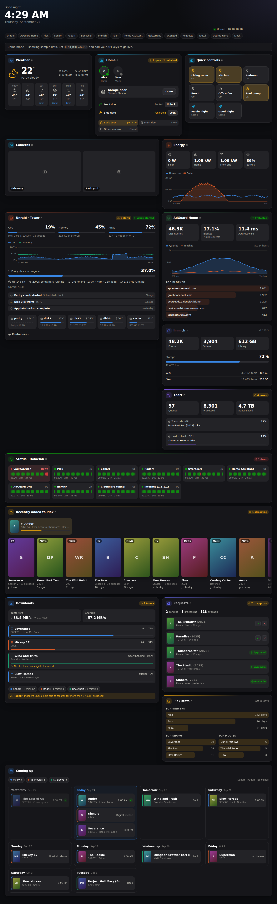

# Unraid Dashboard



A good-looking, LAN-only home server dashboard for Unraid. One page shows:

- **Home Assistant**
  - **Weather**: current conditions and a 6-day forecast, plus sunrise and sunset
  - **Home**: who's home, the garage door (open or close it), locks (lock or unlock them), and any doors or windows left open
  - **Quick controls**: tap to switch lights, switches and fans, or run scenes and scripts
  - **Energy**: live solar, home, grid and battery figures, with a 24-hour chart
  - **Cameras**: snapshots that refresh every 10 s. Tap one for a larger view that refreshes every 2 s.
- **Unraid**: CPU, memory and array usage, a CPU/memory chart for the last hour, disk temperatures and usage, parity check progress, UPS, VMs, unread notifications, and a container list with start/stop buttons
- **AdGuard Home**: queries, block rate, response time, a 24-hour query chart, top blocked domains
- **Status** (Uptime Kuma): every monitor with its recent heartbeats and 24-hour uptime
- **Plex**: recently added posters plus anything currently streaming
- **Downloads**: the Sonarr, Radarr and Bookshelf download queues with progress, stuck imports, health warnings and missing counts, plus **qBittorrent** and **SABnzbd** speeds
- **Requests** (Overseerr or Jellyseerr): pending requests, which you can approve or decline from the dashboard
- **Plex stats** (Tautulli): top viewers, shows and movies over the last 30 days
- **Coming up**: one combined calendar for **Sonarr** (TV), **Radarr** (movies) and **Bookshelf** (books), which you can filter by source
- **Immich**: photo and video counts, library size, storage, per-user usage
- **Tdarr**: queue, processed, errors, space saved, live worker progress

Every card is optional and only appears once its service is configured.

All API calls happen on the dashboard's server, so your API keys and Plex token never reach the browser. Posters go through the dashboard too. The page refreshes itself (Unraid every 10 s, AdGuard every 30 s, calendars every 5 min) and pauses when the tab is hidden. It works on phones and follows your light/dark system setting.

---

## Buttons and the PIN

Buttons change real things, so the rules are:

- **Lights, switches, fans, scenes, scripts, locking doors and approving requests** work straight away.
- **Unlocking doors, opening or closing the garage door, and starting or stopping containers** only appear once you set `CONTROL_PIN`.
- When `CONTROL_PIN` is set, *every* button asks for the PIN the first time you use it on a device. After that the device remembers it. Five wrong PINs lock the buttons for 5 minutes.
- The server only accepts actions for entities the dashboard is showing, and it rejects requests from other websites.

To forget a remembered PIN, clear the site data in that browser.

## Wall-tablet (kiosk) mode

Open **http://10.10.10.10:3030/?kiosk** on the tablet, or tap **Kiosk** in the header. Kiosk mode:

- hides the header links and uses larger text
- shifts the page a few pixels every 2 minutes to protect against screen burn-in
- hides the cursor when idle, and offers a **Fullscreen** button when you touch the screen
- dims the screen from 22:00 to 06:00. Change the hours with `?kiosk&dim=23-7`, or turn it off with `?kiosk&dim=off`.
- reloads itself every 6 hours so the tablet picks up updates

Browsers only let a page keep the screen awake over HTTPS, so set the tablet's own "screen timeout" to never. Fully Kiosk Browser on Android handles this well.

## Try it with sample data

```bash
npm install
DEMO_MODE=true npm run dev     # http://localhost:3030
```

## Install on Unraid

### Option A: Docker Compose (needs the *Docker Compose Manager* plugin, or a terminal)

```bash
cd /mnt/user/appdata
git clone https://github.com/mrmrslobos/care-vision.git unraid-dashboard
cd unraid-dashboard
cp .env.example .env
nano .env                      # fill in your keys (see below)
docker compose up -d --build
```

Then open **http://10.10.10.10:3030**.

To update later: `git pull && docker compose up -d --build`.

### Option B: pre-built image from GitHub

On every push to `main`, the included GitHub Action publishes `ghcr.io/mrmrslobos/care-vision:latest`. If the repository is private, open the package on GitHub and set it to **public** first, or run `docker login ghcr.io` on the server. Then in Unraid go to **Docker → Add Container**:

| Field | Value |
|---|---|
| Repository | `ghcr.io/mrmrslobos/care-vision:latest` |
| Network | `bridge` |
| Port | container `3030` → host `3030` |
| Variables | add each setting from `.env.example` you need, e.g. `SONARR_API_KEY` |

## Where to find each key

| Service | Setting | Where |
|---|---|---|
| Unraid | `UNRAID_API_KEY` | Unraid 7.2+: **Settings → Management Access → API Keys → Create**, with the *viewer* role. Older 7.x versions need the **Unraid Connect** plugin, which adds the same page. |
| AdGuard Home | `ADGUARD_USERNAME` / `ADGUARD_PASSWORD` | The login you use for the AdGuard web UI |
| Plex | `PLEX_TOKEN` | In Plex Web, open any item, then **⋯ → Get Info → View XML**. The token is the `X-Plex-Token=` value in the URL. |
| Sonarr / Radarr / Bookshelf | `*_API_KEY` | **Settings → General → Security → API Key** |
| Immich | `IMMICH_API_KEY` | **Account Settings → API Keys → New API Key**. Give it `server.statistics` and `server.storage`, or *all*. Server statistics require an **admin** account's key. |
| Tdarr | `TDARR_URL` | No key is needed unless you enabled auth in Tdarr, in which case set `TDARR_API_KEY` |
| Home Assistant | `HA_TOKEN` | Click your profile (bottom left) → **Security** → **Long-lived access tokens → Create token** |
| qBittorrent | `QBITTORRENT_*` | Your Web UI login. Leave username/password empty if you enabled "Bypass authentication for clients on localhost / whitelisted subnets". |
| SABnzbd | `SABNZBD_API_KEY` | **Config → General → Security → API Key** |
| Overseerr / Jellyseerr | `OVERSEERR_API_KEY` | **Settings → General → API Key** |
| Tautulli | `TAUTULLI_API_KEY` | **Settings → Web Interface → API → API key** |
| Uptime Kuma | `UPTIME_KUMA_SLUG` | Create a **Status Page**, add your monitors, and use the slug from its URL (`/status/<slug>`). No key is needed. |

**Home Assistant tips**

- The Home card finds people (`person.*`), garage doors (`cover.*` with the *garage* class), locks, and door/window sensors automatically.
- `HA_CONTROLS=light.kitchen,light.lounge,scene.movie_night,switch.fan` picks exactly which buttons appear, in that order. Without it, you get up to 16 lights and 8 scenes.
- To hide something anywhere on the dashboard, add it to `HA_EXCLUDE`.
- For the energy card, point `HA_SOLAR_POWER`, `HA_HOME_POWER` and `HA_GRID_POWER` at **power** sensors (W or kW), not energy (kWh) sensors. `HA_GRID_POWER` should be positive while importing and negative while exporting.

**Container buttons** need the Unraid API key to have the **admin** role. A *viewer* key still shows everything, but can't start or stop containers.

Each card appears only once its service is configured. Delete a service's lines to hide its card. If your apps don't use the default ports, change the `*_URL` values.

## Troubleshooting

- **A card shows "unreachable":** the dashboard container can't reach that address. If the app runs on a custom network (`br0`, or anything with its own IP), enable **Settings → Docker → Host access to custom networks** (stop Docker to change it), or run the dashboard on the same network.
- **"HTTP 401 — check the API key":** the key is wrong or doesn't have enough permissions.
- **Unraid card fails but the others work:** make sure `UNRAID_URL` matches how you reach the web UI. If you use HTTPS with a self-signed certificate, add `NODE_TLS_REJECT_UNAUTHORIZED=0`.
- **A card shows a "Stale" badge:** the last refresh failed, so it is showing the previous data. Hover over the badge to see why.
- **Calendar days are off by one:** set `TZ` to your timezone.

## Development

```bash
npm run dev        # http://localhost:3030
npm run lint
npm run typecheck
npm run build
```

Built with Next.js (App Router) and has no database. The integrations live in `src/lib/services/*`, and the cards in `src/components/cards/*`.
